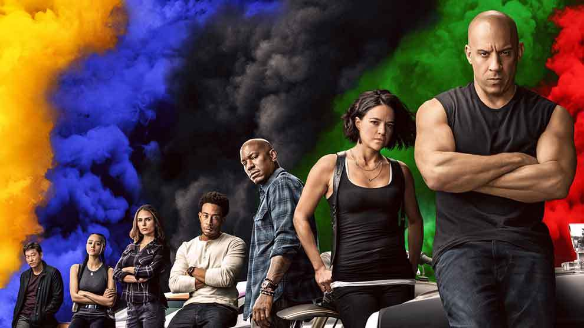
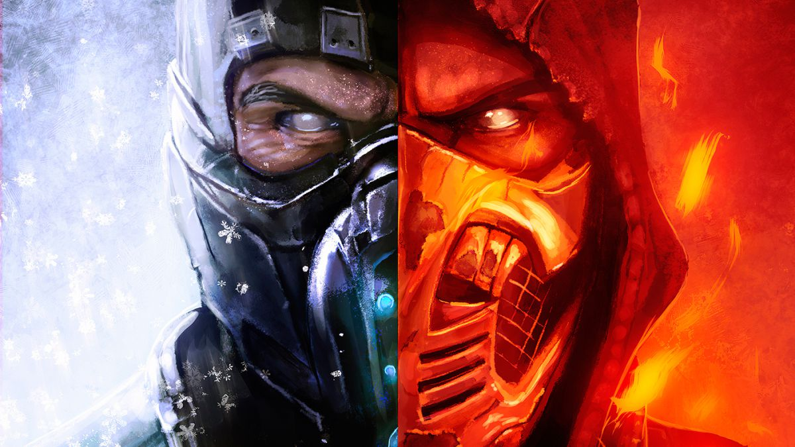
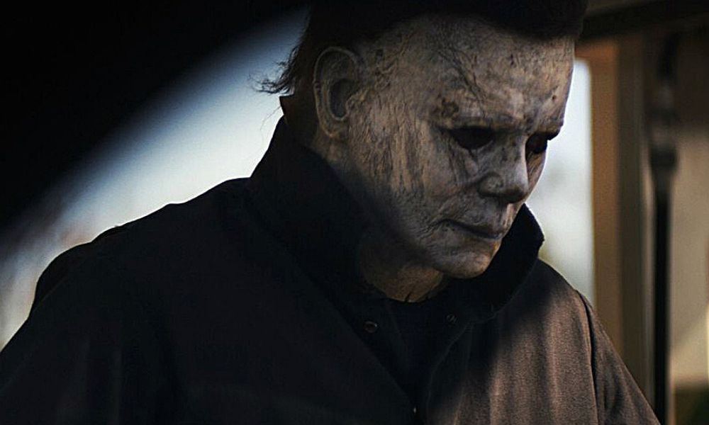

#Peliculas de Estrenos

###Spiderman no way home 
>
>Spider-Man: No Way Home narra una nueva aventura de Peter Parker (Tom Holland), 
cuya identidad se ve revelada y ya no puede separar su vida normal de los riesgos de 
ser un superhéroe. Tras pedirle ayuda al Doctor Strange, los riesgos se vuelven aún 
más peligrosos y le obligan a descubrir lo que significa ser Spider-Man.

###Fats and furious 9
>
>Instalados en su vida familiar, Dom (Vin Diesel) y Letty (Michelle Rodriguez) 
viven en el campo con Brian, el hijo de Dom. Pero los problemas siguen tocando 
la puerta a la familia: Jakob (John Cena), el hermano menor de Dom, se ha unido 
con Cipher (Charlize Theron) para causar estragos y cumplir un deseo de venganza 
por parte de Cipher tras de los sucesos de The Fate of the Furious. El equipo se
reunirá una vez más para mantener a la familia unida y deshacerse de los problemas de una vez por todas.

###Mortal Kombat
>
>El legendario Raiden guía al guerrero Liu Kang, a la policía detective Sonya Blade 
y a la estrella de cine de artes marciales Johnny Cage a una isla remota para 
competir en el torneo Shaolin conocido como Mortal Kombat. Si los Outworld ganan 
el Torneo Shaolin diez veces seguidas, podrán entrar en la Tierra y dominarla.

###Uncharted
>
>Otra de las películas que aún no tiene una sinopsis, además es probable 
que la fecha de estreno se programe de nuevo, ya que aún están en grabaciones.

###Halloween Kills
>
>Laurie Strode (Jamie Lee Curtis) volverá a enfrentarse a su viejo archienemigo 
Michael Myers, la figura enmascarada que la había perseguido desde que escapó de 
aquella fatídica noche hace cuatro décadas. Esta continuación del reboot de 
La noche de Halloween (2018), basada en el clásico de terror de 1978 dirigido por 
John Carpenter, es la segunda entrega de esta saga producida por Blumhouse.

